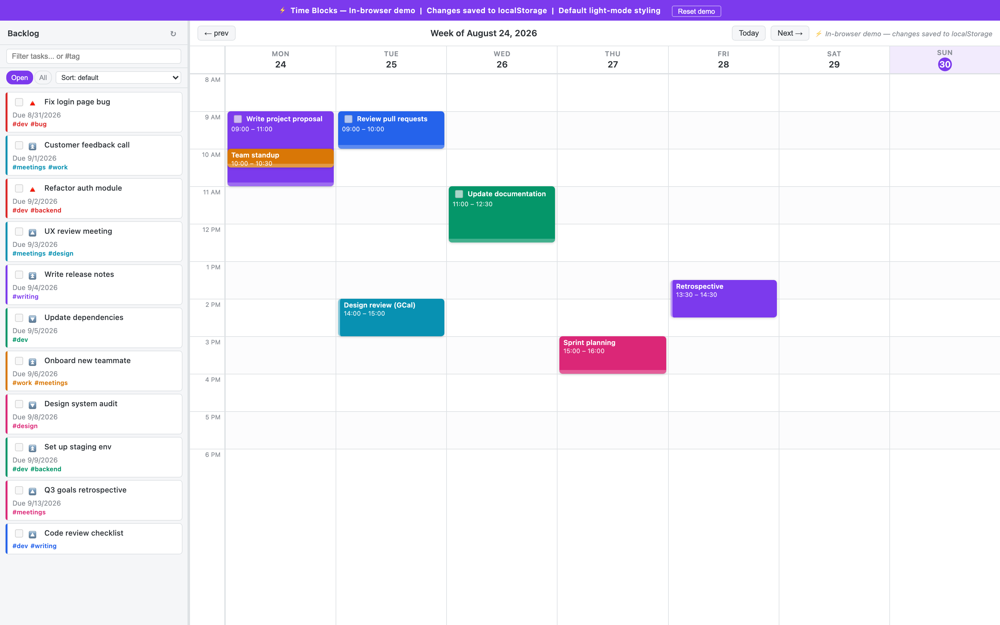
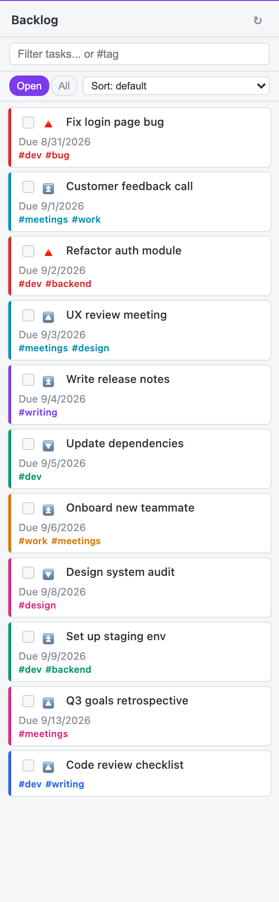
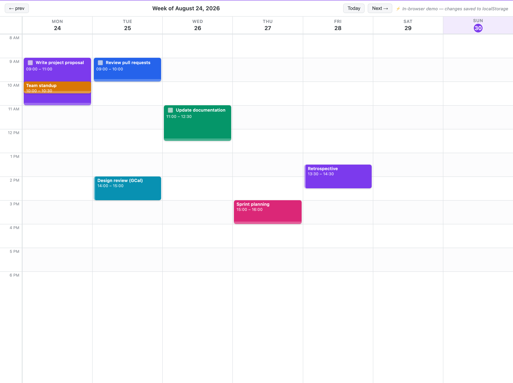
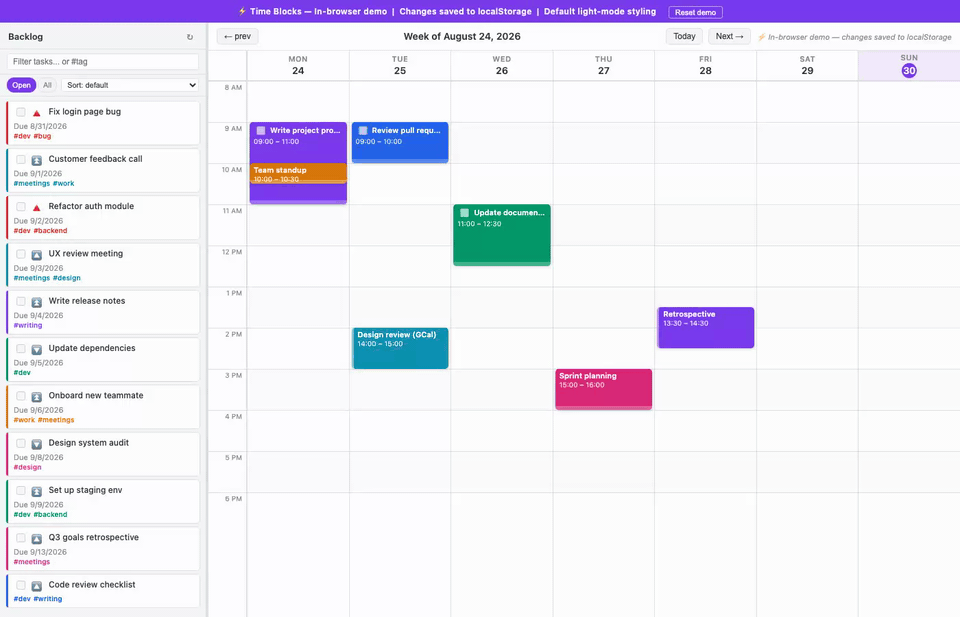

# Time Blocks

> **A drag-and-drop weekly planner for Obsidian.** Turn your vault tasks into a visual schedule — drag any task onto the calendar grid, resize it to set duration, and optionally push everything to Google Calendar with two-way sync.



---

## Why Time Blocks?

Most task plugins show you *what* to do. Time Blocks shows you *when*.

- **No YAML editing.** Drag-and-drop from your task backlog straight onto the calendar.
- **Works with tasks you already have.** Reads the [Obsidian Tasks](https://obsidian-tasks-group.github.io/obsidian-tasks/) emoji format — no migration needed.
- **True two-way Google Calendar sync** with conflict resolution — not just a read-only ICS overlay.
- **Day view** in the right sidebar for focused single-day planning.
- **AI-agent friendly.** An [`AGENTS.md`](AGENTS.md) guide lets AI tools read your backlog and schedule blocks directly via `data.json`.

---

## Features

### Weekly calendar grid

A 7-day, hour-by-hour canvas with configurable workday bounds (default 8 am–6 pm), sticky day headers, and a live current-time indicator.


- Drag any task from the backlog and drop it on a time slot — the block snaps to 15-minute increments.
- Drag a block to move it to a different day or time.
- Drag the **bottom edge** of a block to resize it.
- Click **×** to remove a block from the schedule.

### Task backlog sidebar



Automatically scans your entire vault for tasks written in Obsidian Tasks emoji format (`- [ ] task text 📅 2025-07-15 ⏫`) and displays them in a resizable sidebar. Tasks already scheduled for the current week are hidden.

- Sorted by priority then due date.
- **Tag chips** — click to filter the backlog to a specific tag.
- **Overdue tasks** pinned to the top with a red indicator and a one-click Clear action.
- Filter by text, tag, or completion status directly in the sidebar (no settings round-trip).

### Block resize


### Day view


<!-- NOTE: this screenshot needs to be re-captured from the real Obsidian app.
     The Day view (single-day right-sidebar layout) is Obsidian-only UI and is
     not implemented in the plain-JS preview app used to regenerate the other
     screenshots on this page — see docs/MAKE_ASSETS.md for capture steps. -->


A single-day sidebar view for focused planning. Navigate between days with arrow buttons. Supports the same drag-and-drop, resize, completion toggle, and delete actions as the weekly grid.

### Google Calendar integration

Two layers of calendar integration:

1. **ICS overlay (read-only)** — Paste one or more private ICS feed URLs from Google Calendar. Events appear as read-only blocks on the grid, colour-coded separately from task blocks.
2. **Two-way sync (OAuth 2.0)** — Push scheduled blocks to Google Calendar and pull remote changes back. Includes conflict resolution, rate-limit handling, and writable-calendar permissions.



### Custom query backlog


<!-- NOTE: this screenshot needs to be re-captured from the real Obsidian app.
     The plugin Settings tab (where Custom Query lives) is rendered by
     Obsidian's PluginSettingTab API and is not reproduced in the plain-JS
     preview app — see docs/MAKE_ASSETS.md for capture steps. -->


Switch from "show all" to a custom multi-line query using the [Obsidian Tasks query syntax](https://obsidian-tasks-group.github.io/obsidian-tasks/queries/). 16 rule types: status, due/path/tag/priority filters, sort, and limit.

```
not done
tag includes #work
priority above low
due before 2025-09-01
sort by priority
limit to 20 tasks
```

---

## Quick start

1. **Install** — see [Installation](#installation) below.
2. **Open the view** — click the 📅 calendar icon in the ribbon, or run the command *Open weekly time-block view*.
3. **Browse your backlog** — the left sidebar lists all incomplete tasks from your vault.
4. **Schedule a task** — drag a task from the backlog and drop it on a day/time slot. A block is created at the default duration (30 min, configurable).
5. **Adjust blocks** — drag to move, drag bottom edge to resize, click **×** to remove.
6. **Navigate weeks** — use the **‹** / **›** arrows in the header, or click **Today** to return to the current week.



---

## Installation

This plugin is currently in pre-release. Choose the option that fits you:

### Option A — BRAT (easiest, recommended)

1. Install the [BRAT community plugin](https://github.com/TfTHacker/obsidian42-brat).
2. Open *Settings → BRAT → Add beta plugin*.
3. Enter: `https://github.com/jonmccon/obsidian-time-blocks`
4. Click **Add plugin**, then enable **Time Blocks** in *Settings → Community plugins*.

BRAT keeps the plugin updated automatically when new releases are published.

### Option B — Download a release

1. Go to the [Releases page](https://github.com/jonmccon/obsidian-time-blocks/releases) and download the latest `main.js`, `styles.css`, and `manifest.json`.
2. Copy them into your vault:
   ```
   <vault>/.obsidian/plugins/time-blocks/
   ```
3. Enable **Time Blocks** in *Settings → Community plugins*.

### Option C — Build from source

```bash
git clone https://github.com/jonmccon/obsidian-time-blocks.git
cd obsidian-time-blocks
npm install
npm run build
# Copy main.js, styles.css, manifest.json → <vault>/.obsidian/plugins/time-blocks/
```

---

## Settings reference

| Setting | Description | Default |
|---|---|---|
| **Workday start** | First hour shown on the grid (0–12) | 8 |
| **Workday end** | Last hour shown on the grid (12–24) | 18 |
| **Default task duration** | Minutes when a task is first dropped (15–240) | 30 |
| **Backlog mode** | `All tasks` or `Custom query` | All tasks |
| **Tag filter** | *(All tasks)* Only show tasks with this tag | *(empty)* |
| **Show completed tasks** | *(All tasks)* Include done tasks in backlog | Off |
| **Custom query** | *(Custom query mode)* Multi-line filter, one rule per line | *(empty)* |
| **Task block color** | Background color for scheduled task blocks | `#7B61FF` |
| **Calendar event color** | Background color for ICS/GCal event blocks | `#4285F4` |
| **Calendar feeds** | ICS feed URLs (read-only overlay, HTTPS only) | *(none)* |
| **Enable two-way sync** | Push/pull to Google Calendar via OAuth | Off |
| **Calendar API client ID** | Your GCP OAuth 2.0 client ID | *(empty)* |
| **Target calendar** | Calendar ID to push blocks into | `primary` |
| **Conflict resolution** | *Ask / Local wins / Remote wins* | Ask each time |

### Custom query syntax

One filter rule per line. Rules are ANDed together. Lines starting with `#` are comments.

| Rule | Example | Description |
|---|---|---|
| `not done` / `done` | `not done` | Filter by completion |
| `due before <date>` | `due before 2025-09-01` | Due date before |
| `due after <date>` | `due after 2025-01-01` | Due date after |
| `due on <date>` | `due on 2025-07-15` | Exact due date |
| `path includes <text>` | `path includes projects/` | File path filter |
| `path does not include <text>` | `path does not include archive` | Exclude path |
| `description includes <text>` | `description includes meeting` | Title search |
| `tag includes <tag>` | `tag includes #work` | Tag filter |
| `tag does not include <tag>` | `tag does not include #someday` | Exclude tag |
| `priority is <level>` | `priority is high` | Exact priority |
| `priority above <level>` | `priority above medium` | Priority threshold |
| `priority below <level>` | `priority below medium` | Priority ceiling |
| `sort by <field>` | `sort by due` | Sort (priority / due / description) |
| `limit to <N> tasks` | `limit to 20 tasks` | Result cap |

---

## Two-way Google Calendar sync

Two-way sync pushes your scheduled blocks to Google Calendar and pulls remote changes back. It uses OAuth 2.0 with PKCE — no client secret is required.

### Setup

1. Enable **Two-way sync** in *Settings → Time Blocks*.
2. Create a free OAuth client ID in the [Google Cloud Console](https://console.cloud.google.com/):
   - Enable the **Google Calendar API**.
   - Create an **OAuth client ID** (Desktop app).
   - Add `http://127.0.0.1` as an Authorized redirect URI.
3. Paste the client ID into settings and click **Authorize**.
4. Complete the Google sign-in flow in your browser.
5. Click **⇄ sync** in the week header, or run *Sync calendar events*.

### Security note

> ⚠️ `data.json` stores your live OAuth refresh token. **Do not commit `.obsidian/plugins/time-blocks/data.json` to a public repository.** To revoke access, click **Sign out** in settings or visit [Google Account permissions](https://myaccount.google.com/permissions).

### Conflict resolution

| Strategy | Behaviour |
|---|---|
| **Ask each time** | Conflict is reported but skipped — resolve manually |
| **Local wins** | Obsidian's version overwrites Google Calendar |
| **Remote wins** | Google Calendar event overwrites local block |

---

## Known issues

- **Recurring calendar events** — The ICS parser does not expand `RRULE` recurrence rules; recurring events only appear for their original date.
- **ICS timezone offsets** — Events with `TZID` parameters are treated as local time rather than converted from the specified timezone.
- **Custom query unknown rules** — Unrecognised query lines are silently skipped. Check spelling if a filter doesn't work.

---

## Live demo

The GitHub Pages preview at **[jonmccon.github.io/obsidian-time-blocks](https://jonmccon.github.io/obsidian-time-blocks/)** lets you try the full interface — drag-and-drop, week navigation, task search — without installing anything. No vault or Obsidian required.

---

## Vault task format

Tasks must follow the [Obsidian Tasks](https://obsidian-tasks-group.github.io/obsidian-tasks/) emoji format:

```markdown
- [ ] Task title
- [ ] Task with due date 📅 2025-07-15
- [ ] High-priority task ⏫ 📅 2025-07-10
- [x] Completed task
- [ ] Tagged task #work #q3
- [ ] Scheduled to work on it ⏰ 2025-07-11
```

**Priority emojis** (highest → lowest): `🔺 ⏫ 🔼 🔽 ⏬`

---

## Agent / automation support

Time Blocks ships an [`AGENTS.md`](AGENTS.md) guide for AI tools and automation scripts. It documents:
- The full `ScheduledBlock` data model
- How to read and write `data.json` directly to schedule tasks
- Batch scheduling recipes in Python and TypeScript

This means tools like Hermes, Claude, or custom scripts can read your backlog and populate your weekly schedule programmatically.

---

## Development

```bash
npm install          # install dependencies
npm run build        # type-check + bundle
npm run dev          # watch mode
npm run lint         # ESLint
npm test             # Vitest unit tests (173+ tests, no Obsidian install needed)
npm run test:watch   # test watch mode
```

Tests cover: `weekUtils`, `icsParser`, `queryFilter`, `taskQuery`, `gcal/*`.

See [`CHANGELOG.md`](CHANGELOG.md) for the full version history.

---

## License

[MIT](LICENSE) © [Jonny McConnell](https://github.com/jonmccon)
